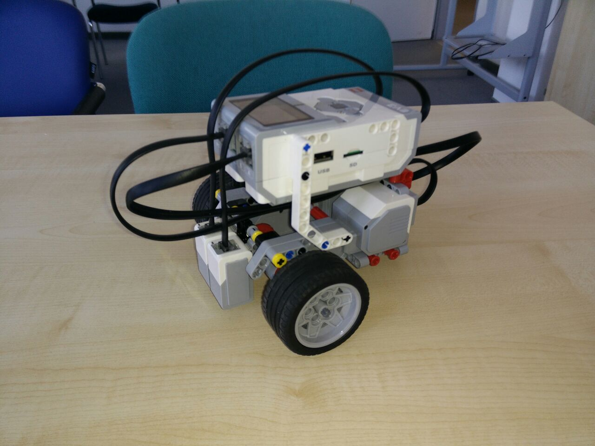

# How to use this repository

You need a Legorobot with 2 ColorSensors attached at the middle axis close to the axis of the big motors.
Your bot may look something like this:



Furtermore you need a line the legobot will follow later. This line should be black on a wite surface and shouldn't be bigger than around 1.5cm.

Met all preconditions? Ok, lets start!

## Upload code to server and robot

Clone this repository and place it somewhere you easily can enter it with command line.
Establish an ssh connection to robot and copy over the whole repository.

## create network_functions.txt

You can add python files to this file which will get executed to control the robot.
The robot sends in sensor data to the server which is then passed to the python programs in the file.
In order to have a valid control you at least need to add the `main_ap.py`.
However you might also want to add `logger.py` and `black_line_stop.py` or you just write your own.
The example file network_functions.example can be used as a starting point.
It has the syntax:

```
filename[TAB]priority
```

Files with a higher priority will get the data first. The data is past down the chain to the other python programs.

## use the right hardware

I found the following setup most useful:

- use a TP-LINK Wifi dongle (Model: TL-WN725N)
- connect the robot to a wifi access point
- connect access point to switch
- connect server to switch

You can also connect your server direcly to your access point when your access point has enough ports.
In order to do life migration you have to use harware which is capable of handling 1GB LAN.
Make sure you use a channel which is not used and the access point is placed close to the robot.

## adjust ip constants and test setup

ssh into your robot and open `ThisRepo/node/constants.py`. Adjust the ip adresses there so it fits your setup.
Do the same in the repo on your server. You might want to adjust the debuglevel, too and the ports the motors are connected to.

After that is done ssh into your robot again and execute `main_bot.py` with python3:

```sh
./main_bot.py
// or
python3 main_bot.py
```

Open another terminal and access the directory of this repository. Type:

```sh
./dispatcher.py
// or
python3 dispatcher.py
```

You now should see some output while server program and robot are initialized. At some point your robot will ask for `white` and `black`.
Place the robot over your background and press enter, now move the robot to the line so that the colorSensors can see the line and press enter again.
The sensors are now calibrated for your setup.
Move the robot in its starting position and press enter again to start the controlling.

Depending on how good the connection is, your robot should start moving on the line and stopping when a packages is missed.
You can stop the robot by pressing CTRL-C in your robot terminal or in your server terminal. However that might fail when the wifi connection drops. So make sure that you always have an eye on the robot when its moving.

## Live migrate the server while controlling

This part - albeit working - will lead to some problems with the control after the live migration is done because of the system time beeing off after the migration.
However, to do this you need to install qemu and kvm on your both server machines.
You also need to follow the following steps on both servers to make sure your setup works:

1. Follow the instructions on [this](ask.xmodulo.com/configure-linux-bridge-network-manager-ubuntu.html) website to setup a bridge. Make sure, to name your bridge `br0`
2. Setup the vm side of the bridge

```sh
# create tap interface
sudo ip tuntap add \
    name tap0 \
    mode tap \
    user $(whoami) # or just your username

# add tap interface to bridge
sudo brctl addif br0 tap0    
```

3. create qemu image and start machine the first tim

```sh
qemu-create MY_IMAGE.img 5G

# make sure to replace the dummys (especially the mac which can be something but unique)
# actually a new mac is not really required
sudo kvm -hda MY_IMAGE.img -cdrom PATH/TO/INSTALL_ISO.iso -boot d -m MEMORY[e.g.512] -netdev tap,id=net0,ifname=tap0 -device e1000,netdev=net0,mac=MA:CA:DD:RE:SS:FF
```

4. install operating system

5. close

6. start again but this time without iso and boot option on one server

```sh
sudo kvm -hda MY_IMAGE.img -m MEMORY[e.g.512] -netdev tap,id=net0,ifname=tap0 -device e1000,netdev=net0,mac=MA:CA:DD:RE:SS:FF
```

7. start the other server with the same image but with incoming migration connection

```sh
sudo kvm -hda MY_IMAGE.img -m MEMORY[e.g.512] -netdev tap,id=net0,ifname=tap0 -device e1000,netdev=net0,mac=MA:CA:DD:RE:SS:FF -incoming tcp:0:4444 (or other PORT))
```

8. start the migration by typing the folliwng into the **qemu monitor** if the running server

```sh
migrate -d tcp:B:4444 (or other PORT)
```

9. check the status of the migration by typing

```sh
info migrate
```

At some point both server will flip their state and the first server will have a freezed qemu instance but the second server will have a running instance instead.